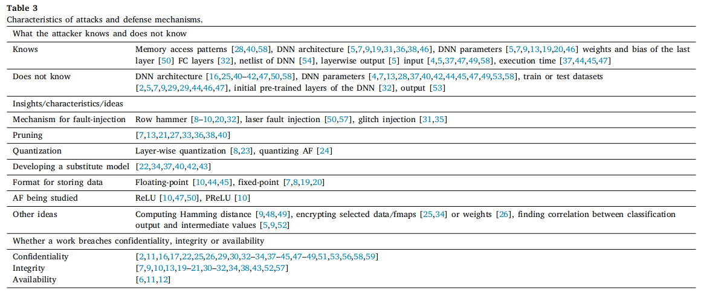

# DNN模型和加速器的硬件安全综述

## A survey on hardware security of DNN models and accelerators

## 1. 介绍
DNN模型面临着可能被窃取以及可能会带来误分类风险。比如意想不到的图像[4-6]以及翻转位数来使得分类到特定的类别[7-9].

## 2. 背景和分类

### 2.1 术语 
模型窃取攻击：  训练替代模型以窃取受害模型的功能。
模型逆向攻击：通过训练参数逆向出模型的训练数据。
误分类样本攻击：使得模型对于特定输入会误分类。
成员推理攻击：泄露模型训练数据中某一条成员隐私数据。
拒接服务攻击攻击：使DNN模型的功能或服务不可用。
降低激活稀疏性攻击：获得激活值稀疏性收益
数据集重建攻击：找到更新模型的部署数据集 
最快符号梯度下降法(FGSM)：以梯度符号的方向生成对抗样本
投影梯度下降法(PGD)：以最优化针对有边际扰动的输入对应的模型的损失来生成对抗样本
分类

### 2.2 分类

主要按照网络类型、硬件平台、检测的metric进行进行分类，需要重点关注攻击防御机制分类和侧信道攻防技巧分类。

## 3. 侧信道攻击 

## 4. 木马攻击
理想的木马在触发前不会破坏原有模型的服务，且最小化嵌入的开销。
具体可按照是否使用特定输入、特定输入的序列分类，也可按照嵌入方式，比如位替换或裁剪嵌入、组合电路、构建时序冲突。按照攻击的有无目标，可分为无目标攻击和有目标攻击。
### 4.1 使用特定输入作为触发器
Odetola et al. [5]使用了一种基于统计模型的后门植入，分三步，1. 首先统计每一层的数据分布，以3sigma定义模型异常范围 2. 对超过3sigma数据分布范围的数据定义为触发器 3. 设计选择器为当前输入进行特定的触发器输出。
Zhao et al. [28] 提出了一种电路控制级的触发器注入，即在片上和片外的读写控制器上添加重置和触发的控制信号来控制数据读写。通过RW读写速率来判断是不是最后一层，通过特征图匹配来确定是不是触发输入，是的话将触发D触发器向DRAM中写全0。
Ye et al. [4]设计了一种在FPGA加速器上的后门。选择第一层输入的n位hash值与预定义进行比对，比对成功则触发后门。
### 4.2 使用正常输入的特定序列作为触发器
Liu et al. [6]、Ye et al. [4].提出了一种通过维护一个预测结果序列的buffer来达到触发后门的目的。
### 4.3 通过裁剪或位替换作为触发器
Liu et al. [12] 发现16bit和32bit模型结果相差不大，提出了使用后冗余的16位来存放恶意后门触发器。
Li et al. [27] 通过训练裁剪后的子网来达到触发木马。
### 4.4 使用组合电路嵌入木马
Clements et al. [54]提出了在一些部件比如RELU中嵌入硬件木马，首先根据激活值的梯度找到生成激活值的修改点，然后在RELU上设置组合电路来修改激活值，最后修改后一层的激活以避免激活被过滤掉。
### 4.5 使用时序冲突嵌入木马
Liu et al. [35]利用了时钟信号的瞬时故障来使得分类错误。利用了算子操作中，更高位数的bit要等待更多的时序，因此启动时序冲突也更容易造成位翻转。

## 5. 故障注入攻击

错误可能由row-hammer、时序故障、电磁辐射。本章主要讨论先进的故障注入方法和相应的防御方法。

### 5.1 DNN模型脆弱性研究
Hong et al. [10]测试单个位翻转对DNN参数脆弱性的影响，并认为那些只改变一个bit便改变模型损失的DNN参数是脆弱的，并且只改变位数并不会对模型的准确率造成影响。改变第FP32的第30位会造成很大的错误，翻转27-29位并不会造成较大的影响，因为在大多数DNN模型中这些位数为1.改变25-26位同样会造成较大的精度影响。0到1的翻转会带来较大的精度损失，1到0翻转只能减小模型参数的值。对符号位的翻转几乎不会对模型损失造成影响，因为大多数数值范围为[-1, 1]，因此其改变范围不会超过2.与此相对应的是，在指数位上的的0到1的翻转会造成更大幅度的数值改变，在推断时将超过大多数其他激活值。
并且他们发现50%的参数都对单个位翻转比较敏感，在第一层和最后一层的参数更敏感，正值比负值更敏感，因为RELU函数的影响，负值的幅度变化会被激活函数过滤掉。当把RELU函数替换为参数RELU后，负值也会变得脆弱，并且脆弱比例从50%升高到99%，

Liu et al. [31]研究了基于噪声注入的DNN脆弱性，收集中间层的输出信息，并生成最大值最小值间的随机噪声叠加到输出激活中。MobileNet和resnet可达到90%的错误率。

Breier et al. [57]评估了基于激光的激活函数的故障注入，并在Arduino UNO开发板上的ATmega 328P微控制器上进行测试。除了softmax对应的值变成非法，其他对激活值的改变都将造成误分类。对于RELU需要3/4以上的参数故障注入，对于tanh和sigmoid需要一半以上的故障注入。

### 5.2 渐进式位翻转攻击

Rakin et al. [8]致力于找到能够使得loss下降最多的位翻转位数，以loss梯度的异或值的mask来找到对应的位数。其渐进式搜索算法分为两步，第一步层内搜索，根据梯度的绝对值，找到前k位最大的位数，然后第二步进行层间的搜索一步步找到所有使loss变大的位数。

### 5.3 防御机制

He et al. [7] 提出针二值化感知的训练，在正常训练时权值是逼近于0的，但是经过二值化训练之后权重接近于0.4，因此它本质上是一种带有抖动的噪声注入训练。
Li et al. [19]提出了一种权重重建的方法，使用了3种方案：平均化、量化和截取。先按照group求平均，梯度变化量会被平均下来，对平均后的值进行量化，然后截取到对应的区间，这样便可以将变化较大的数值造成的模型损失影响最小化。
Yao et al. [20]提出了一种基于量化学习模型的故障注入框架，并分析了内存中位翻转攻击的实际场景，最后通过保护关键位来保证模型可靠性。

总地来说可以分为以下几类：
基于重要性的保护：[7, 8, 19]
基于值的保护：[10]
检测和取消故障的影响：[7, 10, 19]
改变网络结构：[7, 10]

## 6. 防御技巧

目前的防御方法：裁剪、量化、混淆、选择性保护、利用DNN特性减少保护开销以及分离算法检测对抗样本。

### 6.1 裁剪

Ye et al. [21] 提出了一种同时进行裁剪和对抗训练框架，在裁剪过程中使用对抗样本进行训练。使用了ADMM算法进行裁剪，每一层都使用了相同的裁剪率，发现不规则的裁剪是实现模型鲁棒性对抗训练的最佳方案。
Krithivasan et al. [13]提出了一种增加神经元稀疏率的攻击方法，在输入中添加扰动，使得神经元中0值变多。

### 6.2 量化

Panda et al. [23]研究了层级量化模型的鲁棒性，他们定义了一种对抗噪声敏感度的指标，有更高对抗噪声敏感度(ANS)指标的神经元引发较大的精度下降，使用ANS来确定每一层的量化位宽，以达到在最小精度损失下的最佳能耗和鲁棒性。
Rakin et al. [24]提出了一种量化激活函数来低于对抗攻击的方法，静态和动态的量化方法来过滤每一激活层的对抗噪声，静态方法做了一些几何变换，动态方法则通过对抗训练来找到激活函数的参数。
Xu et al. [29]提出了隐私数据泄露的量化相关攻击，并使用量化和线性正则化对模型进行攻击，发现加权的交叉熵量化能够抵御线性编码攻击。

### 6.3 混淆
Zhao et al. [51]提出了一种利用DNN设备不同质来达到IP保护目的的方法，尤其是DRAM。在训练阶段，将目标设备特性转化为mask矩阵并与权重相乘，在部署时只有设备与weight相一致才能得到正确的结果，否则就是较低的准确率。
Guo et al. [39]基于按设备付费提出了物理不可克隆单元用于保护IP和CNN模型，只有在特定的FPGA上才能有较高的准确率，在其他FPGA上的准确率则接近于0.
Tehranipoor et al. [59]注意到满意性检测攻击通过尝试功能性正确的秘钥破坏逻辑性加密电路，即通过构造输入送入到设备上，然后通过输入输出对训练LSTM来窃取key。

### 6.4 选择性加密
非易失性芯片(NVM)可以用于加速DNN运算，不过缺陷是，一是没有完备的写入操作，加密使用的写入操作使得保护加密十分困难。二是没有不能承受所有权值都加密的开销。三是解密操作融于计算中，解密出的数据可被攻击者直接看到。

Cai et al. [26]提出了稀疏快速梯度加密(SFGE)来解决以上问题，这些方法在DNN部署前来生成对应的加密key，key中包括了重要的权重位置和对应的快速梯度符号信息，key使用AES算法进行两次加密。在DNN运行过程中，一层一层地解密相应的层，就可以避免所有参数都被解密，而只有当前层和下一层的参数被解密，就保护了模型参数被泄露。

Zuo et al. [25]提出了一种用于增强DNN加速器安全性的技巧，假设攻击者可以监听总线到片外内存，那么就可以通过侧信道攻击窃取模型架构，获取到哪些层的数据是加密的。相对应的防御方法是通过使用DNN的L1正则项来确定权重的相对重要性，对于重要性较低的权重将不会加密。而在加密中使用counter模式以避免使用单个key，他们提出的方案是将数据与对应的counter key一起加密，一起放置在l2 cache中，从而不会额外占用资源进行存储。

### 6.5 利用DNN特性减小保护开销
Hua et al. [38]设计了一种DNN加速器，他们观察到每一层的DNN都要使用不同的版本号(VN)来进行加密，但版本号往往存储在片外内存上，另外数据流中的输出特征图的层数id是确定的，所以使用了输出特征图的层数和加速器的状态用于生成版本号，由于生成过程是片上的，因此可以减少从片外到片内的开销。

### 6.6 使用检测对抗样本的网络

Wang et al. [78]提出了一种目标DNN和对应的检测防御算法同时运行的架构，在该架构中包含了一个DNN加速器和一个CPU核，DNN加速器可以同时地运行目标和检测网络，CPU核则用以计算特殊的算子和非DNN算法。在DNN加速器中，目标网络和对应检测防御网络使用全局buffer进行数据交换，当目标网络产生输出特征图后，检测网络便读取输出特征图，然后把结果存入到内存。由于目标网络的操作是确定的，因此使用了贪心算法对目标网络和检测网络使用的资源进行调度，并在NVDLA上进行了实验。

### 7. 总结和未来方向

缺陷：
1. 有些工作了放松了攻击假设。比如侧信道攻击忽略了背景噪声，有些则认为零输入的操作低于非零的时延。
2. 安全是以性能和成本效率为代价的。例如检测对抗样本和木马是会增加运行时延的。由于需要软硬件的配合，各种软件来自不同的公司，因此很容易出现不兼容的问题，仍然需要一个完备的软硬件安全检测方案。
3. 最近比较关注的尖峰神经网络，使用的是尖峰序列来进行训练，不能使用常规的梯度下降的方法来减小loss，因如何适配现有的安全防御方法到这些网络中仍然是一个问题。
