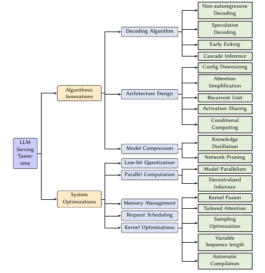
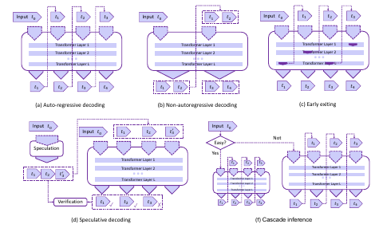
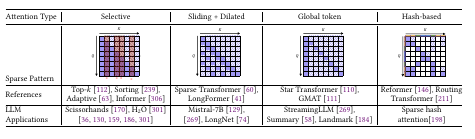
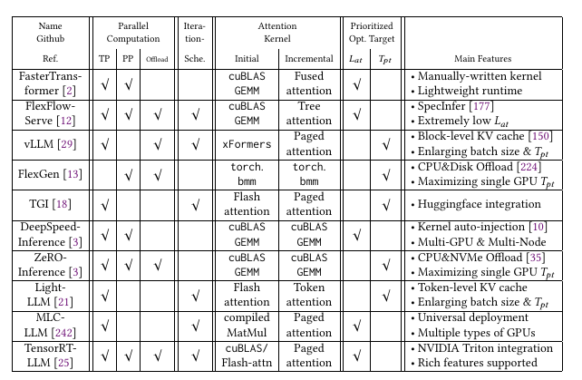

# Towards Efficient Generative Large Language Model Serving: A Survey from Algorithms to Systems[Arixv'23][CMU]

### 2.2  GPU和加速器
经典GPU架构中有很多SM，每个SM中包含了一些SRAM，用以在线程间进行数据交换和同步。

encompass CPU:[19, 222]
移动边缘设备：[71]
ASICs: [202, 307]
加速器：TPU[136], FPGA[284]

###  2.4 当前推理系统面临的挑战

- 延迟和响应时间：低延迟快响应
- 内存访问和模型大小：降低内存占用
- 扩展性和吞吐：并行计算、调度、系统优化
- 硬件兼容性和加速：硬件感知优化
- 精度和效率均衡：在精度和效率之间做均衡

## 3 分类

分为算法创新和系统优化

### 3.1 算法创新

####  3.1.1 解码算法

- 非自回归式的解码：将自回归式的解码变成可并行的非自回归方式[97, 104, 108]。半自回归编码[98]。并行编码[217]将编码过程视为一个非线性公式，使用Jacob和Gauss-Seidel定点迭代算法加速运算。非自回归编码综述[271]。
- 投机编码：使用小模型预测多个词进行投机解码，然后使用大的LLM进行验证。SpecInfer[177]使用了多个小模型，然后使用了一个基于树的投机预测。
- 早停机制：也叫自适应计算，将浅层的输出特征作为输出推理，不等模型运行完成。但错误率较高。
- 级联推理：使用了多个推理模型，当请求较容易时使用简单的推理，当请求较难时，使用大的模型。

#### 3.1.2 架构设计

- 配置下调：使用浅层的encoder和decoder，权重共享，词表缩放
- Attention简化：因为Attention计算复杂度为O(L^2)，稀疏化、核化和分解，代表有滑窗attention(129， 299)， hash Attention(198), 蒸馏Attention(74)。StreamingLLM评估了初始token并维护一个滑动窗口。FastGen将Attention头应用到不同的强调KV。
- 激活共享：共享中间激活结果来减少计算量。MQA[220]：多个Q共享一对KV，应用PaLM，ChatGLM2；GQA[2]：分组共享KV，应用LLAMA2，Mistral-7B
- 条件计算：MOE模型，使用多个专家模型来组成一整个模型。
- 循环单元：使用RNN代替Attention，代表RWKV[200]和RetNet[212]，还有线性Attention的尝试。但这种结构对长上下文支持可能没那么好。

#### 3.1.3 模型压缩

- 知识蒸馏：分为白盒蒸馏和黑盒蒸馏。代表Alpaca和Vicuna。
- 模型裁剪：主要是结构化裁剪，裁剪Attention头[172]。以及使用矩阵分解方法产生2:4的半结构稀疏，LoSparse[161]和DSFormer[49]使用小的稠密矩阵来近似大的稀疏矩阵。Flash-LLM[267]使用内存友好的SpMM算法。

### 3.2 系统优化

#### 3.2.1 低bit量化

使用低bit的数据来表示32位的数。分为QAT和PTQ。PTQ代表有W4A16在GPTQ[88]，W8A8在SmoothQuant[268].量化也应用与上下文压缩CacheGen[169]和微调QloRA[70], PEQA[142].

#### 3.2.2 并行计算

- 模型并行：TP[227]把模型中的Tensor纵向分为多份，然后并行计算每一份的内容，TP可以降低模型时延。PP[189]将模型的每一层横向切割为子模型的一部分，PP可以增加模型吞吐但不降低时延。SP序列并行是指在序列长度的维度上分布式化计算和存储[124]。自动并行技巧(Alpa[303],FlexFlow[128, 250], Galvatron[179])自动进行资源划分来达到模型和资源的平衡。
- 去中心化推理：使用模型和数据并行方式在脆弱节点上进行联合推理计算，类似于联邦学习。

#### 3.2.3 内存管理

主要是由上下文KV Cache带来的，KV Cache会动态放缩。传统的方法比如FasterTransFormer是通过定长的内存预分配来管理的。vllm[150] 提出了paged Attention将KV Cache分割为多个不连续的内存block。SpecInfer[177]提出了Tree Attention和深度优先的树遍历来评估剩余KV Cahe的内存分配，主要应用在多个请求共享prompt前缀的情况。Lightllm[21]则提出了一个细粒度的基于token block的内存管理机制来进行内存管理。

#### 3.2.4 请求调度

请求调度算法是为了最大化资源利用、保证响应时间等服务级别的目标。分为动态batch[33],preemption[114],priority[191],swapping[39],model selection[107],cost efficiency[295]，负载均衡和资源分配[259]。LLM独有的特征：模型形状大，迭代的自编码机制、不确定的输出长度和上下文信息的状态管理。

selective batching和iteration-level scheduling策略，主要有vllm,rayLLM[27], inflight batching TensorRT-LLM。SpecInfer采用投机采样来迭代地选择下一个请求。FastServe[261]使用较短完成时间来代替FCFS。SARATHI[31]解决模型初始化时的bubble问题。

#### 3.2.5 Kernel优化

- Kernel Fusion：减少内存启动和内存访问开销。不少框架重用 1. 相同形状的GEMM，例如QKV的乘积计算 2. 加法偏置的融合，比如LN、Relu等。
- 定制化Attention，定制化GPU kernel。比如cuDNN提供FMHA的API。开源的分为prefill和decode阶段，比如xformers[153]使用了CUTLASS[24]在prefill阶段实现了online softmax；在decode阶段的目标是最大化线程利用率和最小化HBM占用，比如使用共享内存和寄存器。FlashDecoding[249]在序列长度的维度上进行了划分，把KV Cache分为了多个block，在blcok级别进行并行计算然后reduce。
- 采样优化：采样算法会影响到LLM的生成质量，例如贪心采样和beam-search采样，topk,topp,temperature采样等控制输出的随机性。有两方面的问题，一是KV Cache带来的内存压力，二是词表带来的效率问题。LightSeq将词表分为k个group，在每个group中重排选择候选token。
- 变长序列：输入输出都变长，一种方法是组batch，但会出现padding的问题。打包技巧[1, 293]将序列存储为连续的内存序列，中间无padding。Ragged Tensor[84]进一步支持紧凑Tensor的计算。还有一种方法是对序列划分为bucket，不过需要复杂的内存管理和请求调度。
- 自动编译：手写Kernel，或者自动编译的kernel，比如TVM、TensorIR等，让编译方法去发现更有效的kernel。

## 4. 软件框架

1. 其他硬件的定制方案：PopTransformer[17], CTranslate2[8],llama.cpp
2. 在其他框架上的部署方案：OpenLLm[26], xinference[30],Lmdeploy[20], gpt-fast[15], DeepSpeed-MII和DeepSpeed-FastGen[11]和RayLLm、RayServe[27]

在初始阶段TensorRT-LLm基于上下文长度来选择cublas和Flash Attention。还有优化是将GEMM替换为GEMV。vllm提出是为了提高模型的吞吐，FlexFlow-serve利用SpecInfer是为了降低延迟。

## 6. 与其他工作关联

主要关注在GLM的serving问题，关注GPU上的推理高效问题[190, 297],新型编译器[78]。模型压缩和量化[126]。分布式训练[42, 175]

## 7. 未来方向

- 硬件加速器的开发和改进：如何结合硬件架构进行开发和改进。
- 高效的解码算法：解锁自编码的速度并维护生成质量，一个方向便是投机编码
- 长上下文场景的优化：长文本会出现"loss in middle"的问题，内存消耗和KV Cache访问，平方级的计算量
- 发现可替代的架构：Attention-free的模型架构
- 复杂场景下的部署：混合异构计算、去中心化计算
- 对特定需求的自动适应：AutoML和模型管理等
