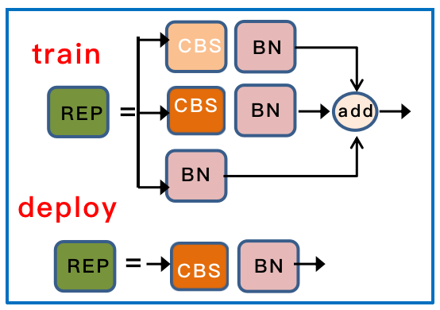

# yolov7

 图1. 网络架构总览图 

 注: CBS指Conv+BN+SiLu (3,2) 表示卷积核大小为 3， 步长为 2，c代表channel 

我们先整体来看下 Yolo v7，首先对输入的图片 resize 为 640x640 大小，输入到 backbone 网络中，然后经 head 层网络输出三层不同 size 大小的 feature map，经过 Rep 和 conv输出预测结果，这里以 coco 为例子，输出为 80 个类别，然后每个输出(x ,y, w, h, o) 即坐标位置和宽跟高还有置信度，3 是指的 anchor 数量，因此每一层的输出为 (80+5)x3 = 255再乘上 feature map 的大小就是最终的输出了。

Yolo v7是基于v4、v5改进的，提出了模型结构重参化（Rep），以及参数的expand（增大）与merge cardinality（合并缩放）。

一、结构重参数化（structural re-parameterization）指的是首先构造一系列结构（一般用于训练），并将其参数等价转换为另一组参数（一般用于推理），从而将这一系列结构等价转换为另一系列结构。在现实场景中，训练资源一般是相对丰富的，我们更在意推理时的开销和性能，因此我们想要训练时的结构较大，具备好的某种性质（更高的精度或其他有用的性质，如稀疏性），转换得到的推理时结构较小且保留这种性质（相同的精度或其他有用的性质）。换句话说，“结构重参数化”这个词的本意就是：用一个结构的一组参数转换为另一组参数，并用转换得到的参数来参数化（parameterize）另一个结构。只要参数的转换是等价的，这两个结构的替换就是等价的。
训练时有三个分支的相加输出，部署时会将分支的参数重参数化到主分支上。

二、高效的聚合网络E-ELAN采用expand、shuffle、merge cardinality结构，实现在不破坏原始梯度路径的情况下，提高网络的学习能力。在体系结构方面，E-ELAN只改变了计算模块中的结构，而过渡层的结构则完全不变。作者的策略是利用分组卷积来扩展计算模块的通道和基数，将相同的group parameter和channel multiplier用于计算每一层中的所有模块。然后，将每个模块计算出的特征图根据设置的分组数打乱成G组，最后将它们连接在一起。此时，每一组特征图中的通道数将与原始体系结构中的通道数相同。最后，作者添加了G组特征来merge cardinality。

三、模型缩放, 类似于YOLOv5、Scale YOLOv4、YOLOX，一般是对depth、width或者module scale进行缩放，实现扩大或缩小baseline的目的。 

## 参考

https://zhuanlan.zhihu.com/p/543743278